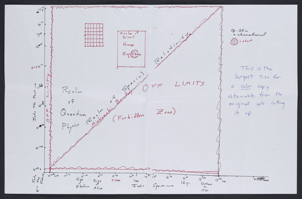
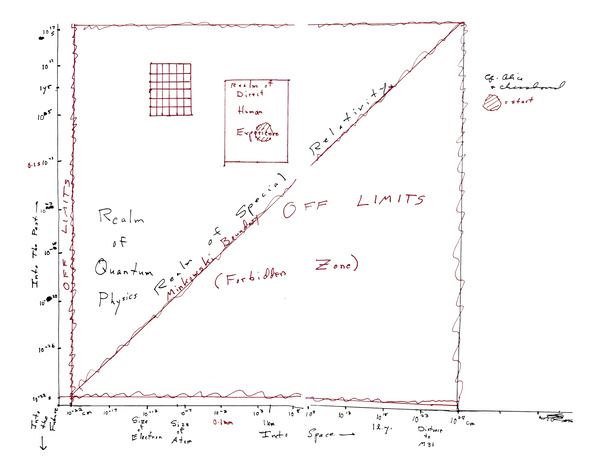

# "Diagram of all space and time" poster

This repo holds my attempt at producing a poster from Carl Sagan's ["Diagram of all space and time"][loc].

The goal is to take the original drawing and tweak it so that it can be printed and hung on my wall.

Here is what it looks like:

<table>
<tr>
<th>Original</th>
<th>Poster</th>
</tr>
<tr>

<td></td>
<td></td>

</tr>
</table>

## What I did

1. Cleared background so the drawing is on pure white
2. Removed cut off text from the top of the drawing (which I _think_ should say "OFF LIMITS")
3. Filled in a couple of cut off red squiggles at the top of the drawing.
4. Removed the note that reads "This is the largest size for a <u>color</u> copy obtainable from the original w/o cutting it up"
5. Scaled it up with Pixelmator Pro's "Super Resolution" so that it could be printed on a 28"x22" poster at 300 DPI

[loc]: https://www.loc.gov/resource/mss85590.084/
